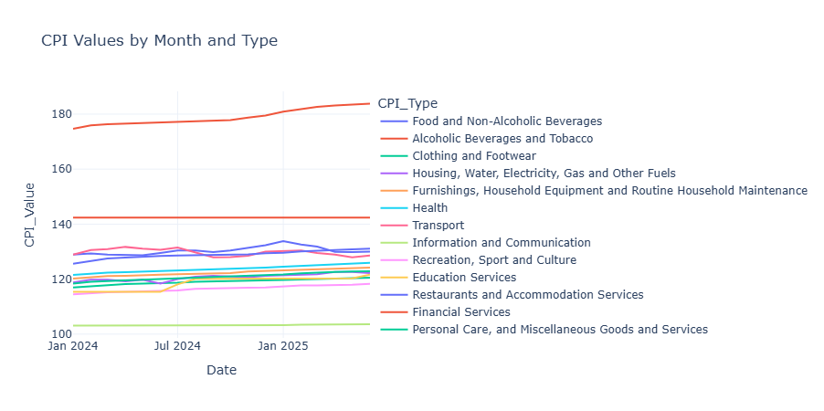

This project analyzes, cleans, and transforms trends in the Philippine Consumer Price Index (CPI) from January 2024 to June 2025, using data from the Philippine Statistics Authority (PSA). It uses a line plot from Plotly Express to create an informative and interactive dashboard, and a heatmap to visualize the standard deviation of the CPI.

